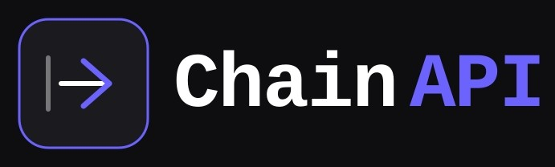

<p align="center">
  
</p>

<h1 align="center">ChainAPI · Next.js &amp; React Anti-Debt Guardrails</h1>

<p align="center">
  17 scope-controlled Cursor rules that stop AI from accumulating technical debt in your Next.js codebase.
</p>

<p align="center">
  <a href="https://chainapi.gumroad.com/l/chainapi-nextjs-guardrails">
    
  </a>
  
  
  
  
</p>

---

## Why this exists

AI coding assistants ship features fast. They also ship:

- Props typed as `any` with zero compiler enforcement
- Empty `catch (e) {}` blocks swallowing production errors silently
- Sequential `await` chains where `Promise.all()` would run 2–3× faster
- `req.body as MyType` — zero runtime validation on untrusted API payloads
- `"use client"` on page-level layouts, disabling every RSC optimization
- SQL queries assembled by string concatenation

Research published at NeurIPS and cited by Carnegie Mellon's Software Engineering Institute quantifies the downstream effect:

> **Unguarded AI code generation correlates with a 41% increase in structural complexity and a 30% surge in static analysis warnings in production codebases.**

The AI is not the problem. Missing constraints are.

This pack encodes those constraints as Cursor `.mdc` behavioral rule files the AI reads before writing any code.

---

## What's in the full pack

17 rules across five layers. Every rule ends with an **Anti-Patterns section** — concrete ❌ Wrong / ✅ Right code snippets, because AI agents learn from examples, not abstract descriptions.

### Core Layer — active on every file

| File | Enforces |
|------|----------|
| `000-core-stack.mdc` | TypeScript strict mode, Python 3.12+, zero AI conversational filler |
| `001-output-optimization.mdc` | Token economy, differential output, no pleasantries or preambles |
| `102-dry-principles.mdc` | AHA principle, magic string isolation, pure utility functions |

### React & Next.js Layer — `**/*.tsx` / `**/*.jsx` / `**/*.ts`

| File | Enforces |
|------|----------|
| `200-nextjs-app-router.mdc` | RSC by default, App Router only, typed routes via `next-safe-navigation` |
| `201-react-components.mdc` | Functional-only components, `interface`-typed props, exhaustive `useEffect` deps |
| `202-tailwind-mastery.mdc` | Utility-first, `cn()` class merging, design-token extension |
| `101-state-management.mdc` | Zustand/TanStack separation, immutable updates, granular selectors |

### Backend & Data Layer — `**/*.ts` / `**/*.py`

| File | Enforces |
|------|----------|
| `100-anti-debt-enforcer.mdc` | Typed errors, explicit imports, structured logging with trace IDs |
| `300-api-contract-zod.mdc` | Zod boundary parsing, single-source types, `.strict()` schemas |
| `301-database-migrations.mdc` | Zero-downtime expand/contract pattern, `CONCURRENTLY` indexes |
| `302-async-performance.mdc` | `Promise.all()`, no sequential awaits, `p-map` batching |

### Security Layer — always active

| File | Enforces |
|------|----------|
| `400-security-boundaries.mdc` | Auth-first endpoints, parameterized queries, no hardcoded credentials |
| `401-webhook-security.mdc` | HMAC signature verification, raw body preservation, idempotent events |
| `402-owasp-auditor.mdc` | OWASP Top 10, Argon2 hashing, path traversal prevention, no `eval()` |

### Quality & Deployment Layer

| File | Enforces |
|------|----------|
| `500-tdd-vitest.mdc` | AAA structure, behavioral test names, scoped mock lifecycle |
| `501-playwright-e2e.mdc` | Semantic locators, no `waitForTimeout`, isolated test state |
| `600-deployment-preflight.mdc` | SHA-pinned images, Zod env parsing, pre-deploy migration jobs |

### Agent context files

| File | Purpose |
|------|---------|
| `AGENTS.md` | Three-Tier Linux Foundation boundary model (Always Do / Ask First / Never Do). Sub-150 lines. Compatible with Claude Code, Codex, SWE-agent, and Devin. |
| `CLAUDE.md` | WHAT-WHY-HOW project onboarding. Explicitly documents Claude Code's three-layer merging model (`~/.claude/CLAUDE.md` → `./CLAUDE.md` → `./CLAUDE.local.md`). |

**[→ Get the full pack on Gumroad ($19)](https://chainapi.gumroad.com/l/chainapi-nextjs-guardrails)**

---

## Free preview — try in 30 seconds

This repo ships two rules as a free preview:

```sh
mkdir -p .cursor/rules

# Core stack constraints — TypeScript strict, no AI filler output
curl -sO --output-dir .cursor/rules \
  https://raw.githubusercontent.com/chainapi/chainapi-nextjs-guardrails/main/preview/000-core-stack.mdc

# Token efficiency and output discipline
curl -sO --output-dir .cursor/rules \
  https://raw.githubusercontent.com/chainapi/chainapi-nextjs-guardrails/main/preview/001-output-optimization.mdc
```

Or clone and copy:

```sh
git clone https://github.com/chainapi/chainapi-nextjs-guardrails
cp chainapi-nextjs-guardrails/preview/*.mdc .cursor/rules/
```

Open any file in Cursor. The rules are live.

---

## How glob scoping protects your token budget

Every rule activates **only** when the file being edited matches its glob pattern. Rules irrelevant to the current file never load into the AI context window.

| Developer task | Rules loaded | Rules not loaded |
|----------------|-------------|-----------------|
| Editing a Playwright test | `000`, `001`, `402`, `501` — 4 rules | 13 rules |
| Editing a Prisma schema | `000`, `001`, `301`, `400` — 4 rules | 13 rules |
| Writing a Zod API route | `000`, `001`, `100`, `300`, `400`, `402` — 6 rules | 11 rules |
| Editing a GitHub Actions workflow | `000`, `001`, `600` — 3 rules | 14 rules |

Your context window goes to generating code, not loading Tailwind constraints when you are writing a database migration.

---

## Full pack installation

After purchasing from Gumroad:

```sh
# 1. Copy all rule files
mkdir -p .cursor/rules
cp SaaS_AntiDebt_Mega_Pack/.cursor/rules/*.mdc .cursor/rules/

# 2. Copy agent context files to project root
cp SaaS_AntiDebt_Mega_Pack/AGENTS.md SaaS_AntiDebt_Mega_Pack/CLAUDE.md .

# 3. (Optional) Create local developer overrides — never commit this file
touch CLAUDE.local.md
echo "CLAUDE.local.md" >> .gitignore
```

Open the project in Cursor. No extension install, no configuration required.

---

## References

[1] Sculley, D., et al. (2015). *Hidden Technical Debt in Machine Learning Systems.* Advances in Neural Information Processing Systems (NeurIPS), 28.

[2] Tamburri, D.A. (2020). *Sustainable Architectures for Artificial Intelligence Pipelines.* IEEE Software Engineering Institute Technical Report.

---

<p align="center">
  Built by <strong>ChainAPI</strong> &nbsp;·&nbsp;
  <a href="https://chainapi.gumroad.com/l/chainapi-nextjs-guardrails">Get the full pack →</a>
</p>
